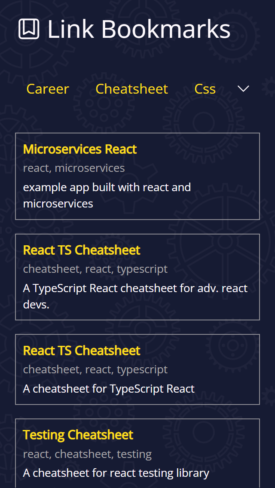
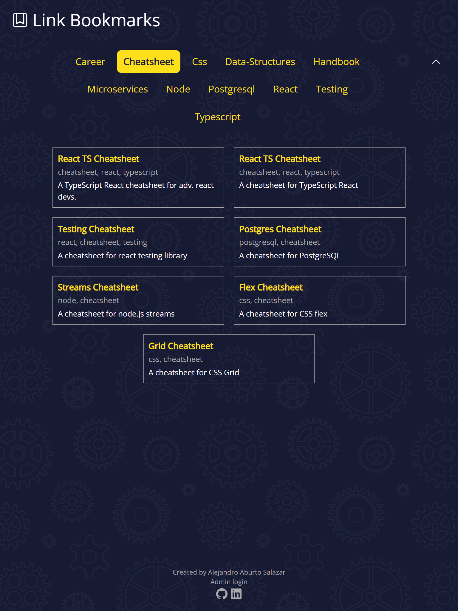
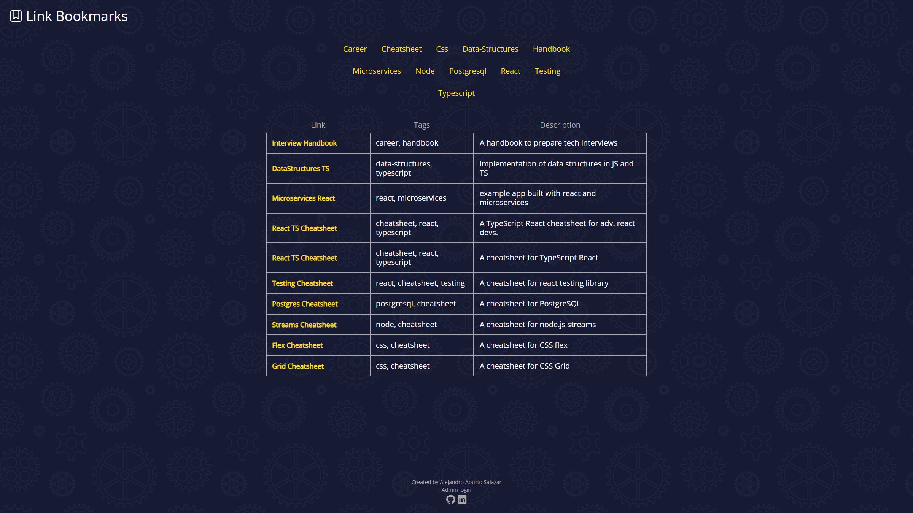

# Bookmark Links

> A place where I can add any useful links for future reference. Links are automatically sorted by tags so they can be easily found.
>
> This website is hosted in vercel: [_Click here to take a look._](https://bookmarks-aburto22.vercel.app/)

## Table of Contents

- [General Info](#general-information)
- [Technologies Used](#technologies-used)
- [Features](#features)
- [Screenshots](#screenshots)
- [Setup](#setup)
- [Project Status](#project-status)
- [New features](#new-features)
- [Authors](#authors)

## General Information

### Context

I wanted to create a cross-browser space to add useful developer links that I can access from anywhere. It was also a good opportunity to
try svelte and svelte-kit to build a full-stack app.

## Technologies Used

### Front-end

- TypeScript
- Svelte
- Svelte-Kit
- Sass
- MongoDB
- Prisma

### Deployment and hosting

- Vercel hosting

## Features

The bookmark links app consist of a single page that displays the appropiate bookmarks based on tags. There is an admin login to add, edit
and remove tags.

## Screenshots

## Setup

Classic svelte-kit project. Start by installing dependencies using `npm install`, and then run the development server using `npm run dev`.

In order to run a local copy, users need to include an .env file in the server folder with the following information:

- DATABASE_URL - Mongo DB connection link

## Project Status

This project is going, and minor improvements might be added.

## New features and bugs

Known bugs:

- In mobile, when selecting a hidden tag and then closing the tag section, the user cannot know which tag he has selected.

## Authors

Bookmark links was created by myself:

- Alejandro Aburto Salazar - [GitHub](https://github.com/aburto22)
